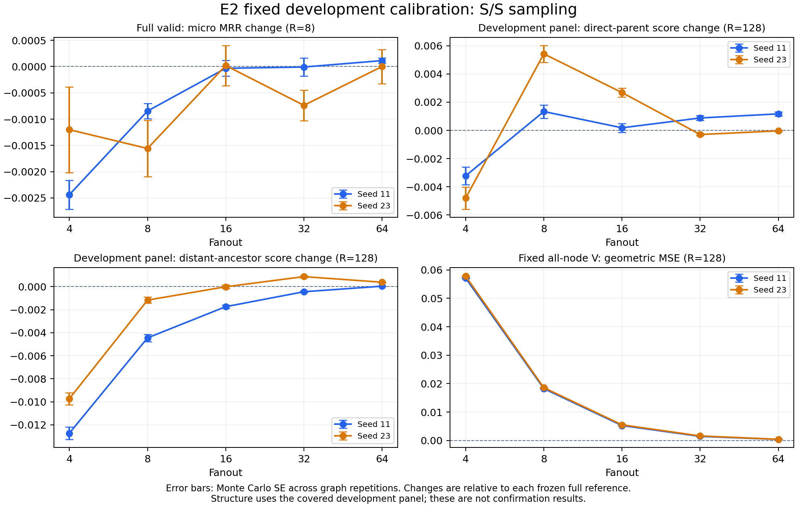

# 采样诱导双曲表示变化：导师汇报

更新至2026-09-17完整E2开发矩阵独立验收。研究问题是：邻居采样是否产生系统性几何偏移，这种偏移经真实传播后是否损伤层级信息，以及轻量切空间修正是否有用。

## 一分钟说明

受控E1实验支持局部方向性偏移及三阶矩修正的局部阶数预测，但多数条件下修正降低偏差同时提高MSE。真实WordNet实验现已完成两个冻结模型、五种采样量：几何误差随采样量增大而下降，结构和任务表现却并非统一、单调地变化。强删减下有结构损失，其他条件也有改善或接近零的结果。当前不能宣布层级坍缩或修正有效。下一步继续E2独立确认，先把新数据上的检验规则与预算固定。

## 阶段目的与结论

| 阶段 | 当前结论 | 目的达成度及边界 |
|---|---|---|
| E0 | 已实现几何/采样路径通过78项CPU与78项真实CUDA检查 | 当前工程范围达到；不是研究效果 |
| E1 | 102条件、435561子集精确枚举；54个非对称/镜像有效记录均减偏差，其中52个MSE上升 | 原E1部分达到；图级D0、弱特征训练等缺口保留 |
| 真实模型准备 | WordNet 82115节点，两个原骨干best均为step768；完整valid MRR约0.01754/0.01393 | 冻结诊断可用；未建立模型竞争力，不是E5完成 |
| E2开发校准 | 10片完整通过独立验收；四路径128次/片、S/S全valid8次/片 | 本批校准达到，原E2整体部分达到；独立确认准备中 |
| E3–E5 | 噪声/深度、机制干预、修正端到端比较尚未科学执行 | 未达到，不能由已有基线或工程小样替代 |

## 最值得说明的结果

- 局部与真实传播有明显区别。f4时A组局部F/S平均径向投影向外，而S/F、S/S向内；真实传播V-MSE约0.056–0.058，局部约0.001。仅依据局部偏差设计修正，尚不能保证下游收益。
- 五档采样下两个模型的固定V四条件MSE均下降；S/S从f4约0.057下降到f64约0.00041–0.00045。这是几何误差的预算关系，不能直接等同层级质量关系。
- f4的两个模型直接父顺序分别下降约0.32/0.48个百分点，正远祖下降约1.27/0.97个百分点；f8直接父顺序改善但远祖仍下降。f16任务改变量均小于MC标准误，f32/f64仍呈混合或近零变化，保留全部预定条件。

图中误差条是整图重复的MC标准误，不是置信区间；任务R=8，结构R=128。结构使用开发面板covered子节点及原设计权重，不能称全图完整层级评价。完整数表见[E2多预算结果](../../reports/E2_MULTIBUDGET_RESULTS.md)。

## 解释限制与下一步

两个模型都存在第二层消息近参数化边界集中（约65.76%/64.10%）；固定根覆盖约63.13%，结构面板1000子节点中722可评价。尚缺独立确认、噪声区分、完整分支能力与跨模型/数据证据；当前不能将观察单独归因于双曲曲率，也不能从统计偏移推出有学术意义的坍缩幅度。

继续E2确认：保留五个预算，使用原冻结确认面板和新随机流；两个池都参与过valid模型选择，故结构节点独立不等于独立任务测试。按开发方差登记多数条件256次几何/32次任务，seed23-f4为512/128、seed23-f8为256/64；合并70项主检验作多重比较处理，报告效应、区间和实际精度，未达标不追加本批重复。此时处于实现和资源准备，尚未运行确认。

## 成本和质量

本批10片实际合计6765 GPU秒（1.8792卡时），每片约10–14分钟；峰值allocated约3.18GB，进程RSS不足2GiB，卡已释放。不同驱动/并发条件的耗时不作受控性能比较。此前两个有界训练基线另用1.4217卡时，旧pilot与工程检查单列；上述不是所有历史任务费用总计。

主管独立核对原始来源和配置、11240数组与28520条数值门槛，并重算全部逐rep几何/结构均值MC SE、80次完整valid排名与任务统计，结果一致。数值验收通过与科学假设成立分别汇报。

下一批确认按实际成本规划约5.7卡时，含25%余量约7.1卡时，最多4卡并行；这是估算，实际以调度记账为准。先固定实现和CPU/CUDA质量门槛，再提交新作业。

## 追溯

- [完整开发矩阵主管验收](../../reports/E2_MULTIBUDGET_ALL_SUPERVISOR_REVIEW.md)
- [E1补充主管验收](../../reports/E1_SUPERVISOR_REVIEW.md)
- [原路线范围审计](../operations/ORIGINAL_ROUTE_ALIGNMENT.md)
- [E2独立确认协议](../operations/E2_INDEPENDENT_CONFIRMATION.md)
