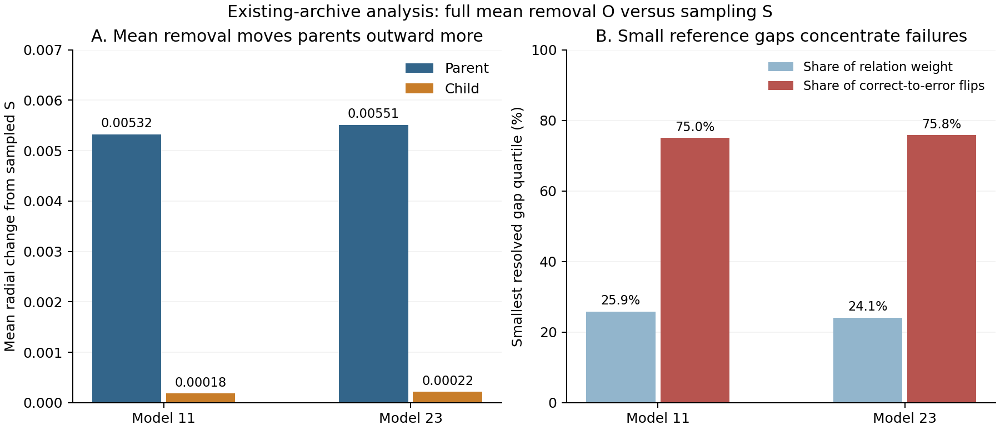
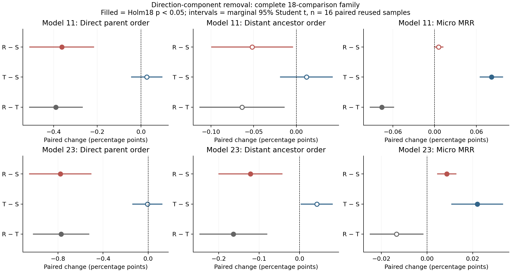

# 修正恢复：诊断干预与HGCN轻量模块

## 2026-09-22：关系感知切空间修正的HGCN阶段A

研究问题：只训练454参数的局部修正器，能否同时恢复成熟HGCN的采样层级损伤与检索损伤，关系损失是否提供额外收益？**当前结论：训练流程与数值验收目的达到；科学恢复目的尚无验收结果。** 新方法的正式训练已放行，不能以旧诊断结果或32步单样本探针宣布有效。

源码`aadbecaa06b40da2f27042473eadf852290f92bd`，配置SHA256为`4047865a86d6dcf85939cfb40f0e34546156445c192e699f88ee7eef079a13fd`。13项本地专项检查、原服务器CPU/CUDA小图及32步真实数据探针均通过主管独立检查；代码任务另独立审阅了探针。32次更新中两层梯度和参数更新均有限且非零，原骨干/任务头权重不变；完整F身份和3次8456查询完整排名已核验，探针权重丢弃。未修改预先设定的参数、选模或统计规则。

| 实测（单张L40） | 结果 |
|---|---:|
| GPU质量检查／真实探针 | 15／153 GPU秒 |
| 峰值分配／保留显存 | 1.344／1.428 GiB |
| 除首次外更新步时中位数／P90 | 0.766／1.857秒 |
| 3次完整排名耗时范围 | 24.37–25.16秒 |
| 骨干是否改变、边界投影次数 | 否、0 |

必须保留的现象：二层累计约79.1%的可修正节点触及预定物理步长上限，末步约95.3%，但梯度仍在；这不等于数值失败，也不作为临时调参理由。训练可见图导出的参考根是`00002137`，评价仍使用原固定根`00001740`，二者参考系不同，不把训练margin满足视作评价层级恢复。探针同图step0→32的开发指标变化只供流程诊断，未通过配对多重复验收。

按[阶段A协议](../docs/operations/RTSC_HGCN_STAGE_A.md)完成两个既有检查点×task-only/task+relation、每组1024步，随后使用新随机流的16次采样×三个预算×三条件评估，主Holm24与关系臂增益Holm12分开。用户最新允许多申请GPU，资源修订为最多3张独立ACL L40并行；不改变实验条件。实测推算四组训练加8个最终分片约3.8卡时，三卡并行墙钟估计1.5–2小时，不含排队；正式训练4组已精确放行，每组调度上限1小时；最终分片按每seed选中权重和完整性验收后单独放行。方法方案见[研究04](../docs/research/04_关系感知轻量切空间修正模块方案.md)。

已完成训练的质量进展：两个模型的task-only与task+relation四组均完成1024更新、保存5个检查点，主管逐档重算每组13份完整排名及直接/远祖层级；代码任务另核验每组冻结骨干、检查点内容与采样计划配对。按预设层级门优先、首次严格最高MRR规则，seed11两臂分别选中step256/768，seed23两臂均选中step256。两个模型内部两臂的初始参数、1024批次与两层图流完全配对，最终八片均已放行。开发图上的改善不作为最终验收；主家族仍等待完整八片。

正式训练的步长截断值得在最终结果中讨论：四组的二层可修正节点实例约98.1%–99.0%触及上限，有限非零梯度仍存在；一层出现少量官方投影，原档保留。暂不改变步长、损失或选模规则。四组正式训练实际GPU用时共5200秒（约1.44卡时）；最终每片worker上限1740秒、Slurm上限1800秒，八片总预留不超过14400 GPU秒，训练与评估合计最多3卡同时运行。

以下是旧诊断模型的历史结果，不是上述新模块的训练成绩。

## 2026-09-17：五条件pilot、关系定位及R/T对照

更新：2026-09-17。研究问题：移除采样平均偏移及轻量局部修正，能否恢复层级与检索；若两者分歧，关系层面发生了什么？

**结论：平均偏移的定向移除能改善当前检索，但可能损害父子顺序；现有可部署候选尚未证明共同恢复。恢复目的部分达到，当前A/B实验已完成并验收。** 方向分解是诊断工具，不是研究创新主线。主线仍是采样引起偏移、关系/任务损伤及有效轻量修正。

## 三步实验如何连接

| 步骤 | 数据关系 | 回答的问题 |
|---|---|---|
| 五条件pilot | 原两best768、f4；每模型16次新的采样，共32次 | 消除均值O与sample-only候选C能否恢复？ |
| A关系定位 | 读取上述存档，不重新采样 | O为何改善检索却损害父子顺序？ |
| B方向干预 | 复用同32次采样，只增加R/T | 不同均值分量的移除有何不同后果？ |

WordNet 82,115节点、8,456验证查询；固定1,000-child结构面板，直接父/远祖可评价child为738/737，unknown与原child-macro权重保留。没有重训或独立test评价。A/B复用了已观察样本，属于探索性机制分析，不能冒充新独立确认。

## 条件定义与部署边界

| 条件 | 含义 | 是否为sample-only方法 |
|---|---|---|
| F / S | 完整邻居 / 原采样模型 | F为完整参照，S为采样基线 |
| O | 在完整参照p的切空间移除独立校准均值 | 否，诊断干预 |
| C | 两层局部聚合应用现有third候选 | 是，但共同恢复未证明 |
| Q | 与O等幅、固定无关方向 | 否，诊断对照 |
| R / T | 只移除径向 / 正交切向均值 | 否，依赖完整p及独立均值 |

O/R/T在末层，C在两层，不能把O/T当C的严格性能上界。径向锚点是固定p[root]，不随条件移动，不是坐标原点。局部切空间正交不保证有限Exp后半径严格不变，R/T效果不能相加成O，也不能分配成几项因果损伤百分比。

## 检索结果

下表 MRR 为原量纲；除 F 外均为16次平均。

| 模型 | F完整邻居 | S采样 | O消除均值 | C轻量候选 | Q随机方向 |
|---|---:|---:|---:|---:|---:|
| seed11 | 0.01753685 | 0.01524555 | 0.01607245 | 0.01550680 | 0.01521100 |
| seed23 | 0.01392854 | 0.01118960 | 0.01151155 | 0.01139397 | 0.01120314 |

| 模型 | C−S MRR | Holm p | C恢复比例 | O−S MRR | Holm p | O恢复比例 |
|---|---:|---:|---:|---:|---:|---:|
| seed11 | +0.00026125 | 0.15067 | 11.4% | +0.00082690 | 1.87e-7 | 36.1% |
| seed23 | +0.00020437 | 0.01465 | 7.5% | +0.00032195 | 0.00012190 | 11.8% |

恢复比例仅为相对于本轮 F−S 均值差距的描述性比率，无区间，不是因果损伤占比。O−Q 的 MRR 在两个模型均显著为正（Holm p 分别约6.76e-8、0.00034355），说明本轮改善不只是任意同幅度移动；范围仍限于本次固定 Q 方向、校准与模型。

## 层级结果

以下为顺序正确率变化的百分点（pp），正值更好；Holm 统一校正全部18项主比较。

| 模型 | 比较 | 父子顺序变化 pp | Holm p | 远祖顺序变化 pp | Holm p |
|---|---|---:|---:|---:|---:|
| seed11 | C−S | +0.0488 | 0.53554 | +0.0080 | 1 |
| seed23 | C−S | +0.0211 | 1 | +0.0096 | 1 |
| seed11 | O−S | −0.3436 | 0.00164 | −0.0481 | 0.53554 |
| seed23 | O−S | −0.7162 | 0.00164 | −0.1110 | 0.03902 |

C 层级提升证据不足，不等于证明其真实作用严格为零。O 在两个模型的父子顺序均显著恶化；seed23 远祖顺序相对 S 也显著恶化。检索改善与层级改善在本轮并不一致，不能用前者替代后者。

## A：检索与层级为何分歧

### 关系定位

| O 相对 S，16次重复均值 | 模型11 | 模型23 |
|---|---:|---:|
| 父节点径向变化 | +0.005321 | +0.005513 |
| 子节点径向变化 | +0.000185 | +0.000216 |
| 父子间隔变化 | −0.005136 | −0.005297 |
| 小参考间隔组占关系权重 | 25.9% | 24.1% |
| 该组占正确→错误翻转权重 | 75.0% | 75.8% |

小间隔组为结果前固定的、可分辨绝对参考间隔的第一四分位组。在实际正确→错误关系中，父节点的加权平均径向变化为+0.02058/+0.03290，子节点约+0.0000013/−0.0000492。这是对已观察现象的描述性定位，不把小间隔容易翻转本身当作新的因果定理。

平均间隔不等于顺序正确率：模型11远祖平均间隔略增，但顺序仍略降，边界附近的关系翻转可以与总体平均移动方向不同。分组没有使用节点独立显著性检验；检索与结构的交集描述也不替代完整查询MRR。

## B：分别移除方向分量的结果

下表是相对 S 的配对均值；星号仅表示全18项 Holm 后 p<0.05。层级列单位为**百分点**，MRR列为**绝对值**，不能混用。

| 模型 | 干预 | 父子顺序变化（百分点） | 远祖顺序变化（百分点） | MRR绝对变化 |
|---|---|---:|---:|---:|
| 11 | 径向 R | -0.3628* | -0.0517 | +0.00005819 |
| 11 | 正交切向 T | +0.0266 | +0.0118 | +0.00081504* |
| 23 | 径向 R | -0.7802* | -0.1214* | +0.00008685* |
| 23 | 正交切向 T | -0.0068 | +0.0425 | +0.00022007* |

T 的 MRR 从0.01524555升至0.01606059（模型11），从0.01118960升至0.01140967（模型23），Holm p分别约3.11×10⁻⁷与0.00800。相对原 F−S 检索损失，描述性恢复约35.6%与8.0%；这不是新增确认检验，也不是层级恢复比例。

R 的父子顺序下降0.3628/0.7802个百分点，Holm p约0.00117/0.000288；模型23的远祖顺序也显著下降。R 的检索收益只在模型23通过校正，不能因此忽略其层级损害。

直接 R−T 对照同样保留：T 的父子顺序在两个模型上均显著优于 R，但 T 的 MRR 显著优于 R **仅在模型11成立**；模型23的直接比较 Holm p≈0.186。不能以“T−S显著而R−S不显著”替代 R−T 检验，也不能声称两个模型都证明 T 的检索优于 R。

图中实心点表示Holm18 p<0.05；横线为每个固定模型16次原采样的边际95% Student-t区间，df=15，未进行同时区间校正。图内所有横轴均换算为百分点，包括MRR。

## 联合判断：已经证明与尚未证明

| 问题 | 当前结论 |
|---|---|
| 平均方向是否与当前任务损伤有关？ | O优于S和固定Q，支持其在本条件下参与检索损伤；不是全部损失的归因比例 |
| 去掉径向均值是否修复层级？ | 当前R反而显著损害两个模型的父子顺序；不能外推为所有径向调整都无效 |
| T是否共同恢复？ | 两模型MRR改善，但四项层级比较均未通过Holm；不显著不等于无损或非劣 |
| 当前轻量C是否有效？ | MRR均值均提高，仅seed23显著；四项层级收益均未建立 |
| 能否据此宣称通用模块？ | 不能。R/T非部署方法，C未联合通过，且仅一图、两固定模型 |

偏差与中心化随机残差是在指定切空间中的分解；邻居信息减少可以同时产生两者，不是相加为100%的独立第三项。父子相对变化才直接决定间隔变化，单节点偏移变小不能代替关系恢复。原GNN弱于文本MLP的限制仍保留。

## 统计、质量及资源

五条件pilot与B各自使用预设18项Holm家族；每模型16次配对采样，df15边际95%区间不是同时区间，也不覆盖训练种子总体或校准均值的不确定性。两个家族来自不同问题，不能事后合并选择有利p值。完整18项表分别保留在历史原报告和机器JSON。

五条件全部存档与独立统计通过；A独立复算32次、192个条件/关系组合、5184分组。B通过原环境合成数值门、4片原F完整排名复现、全部新旧存档CPU读回及独立高精度Holm18统计。科学关系头没有再次全量CPU重跑，独立头检查来自合成门，科学排名由F复现和保存结果审核支持。

五条件源`293ca0beaa50dd9bedacf6f06001ec3b73b2b9b6`；A源`79868c6542a58f9eb206058d87b34cc9b01edac7`；B源`5cbb9edaef1add89f3eec6a88958da68ff2c7f7e`。五条件保守GPU3805秒（约1.06卡时），A/B新增1892秒（约0.526卡时），不是相同账目。资源已结束。

## 当前决定与证据

当前E2 A/B已做完。先讨论可部署、关系感知的修正及层级/检索联合验收标准；尚未冻结新方案或授权新科学运行。方向分解不替代研究主线，不自动进入E3–E5。

- [E2_FROZEN_RECOVERY_RESULTS.md](archive/2026-09-17/04/E2_FROZEN_RECOVERY_RESULTS.md)
- [E2_RADIAL_COMPONENT_RESULTS.md](archive/2026-09-17/04/E2_RADIAL_COMPONENT_RESULTS.md)
- [五条件完整统计](e2-frozen-recovery-results.json)、[A/B完整统计](e2-radial-component-results.json)。
- [五条件原协议](../docs/operations/E2_FROZEN_RECOVERY_AND_BIAS_PILOT_DRAFT.md)、[A/B原协议](../docs/operations/E2_RADIAL_COMPONENT_PROTOCOL.md)原字节保留。
