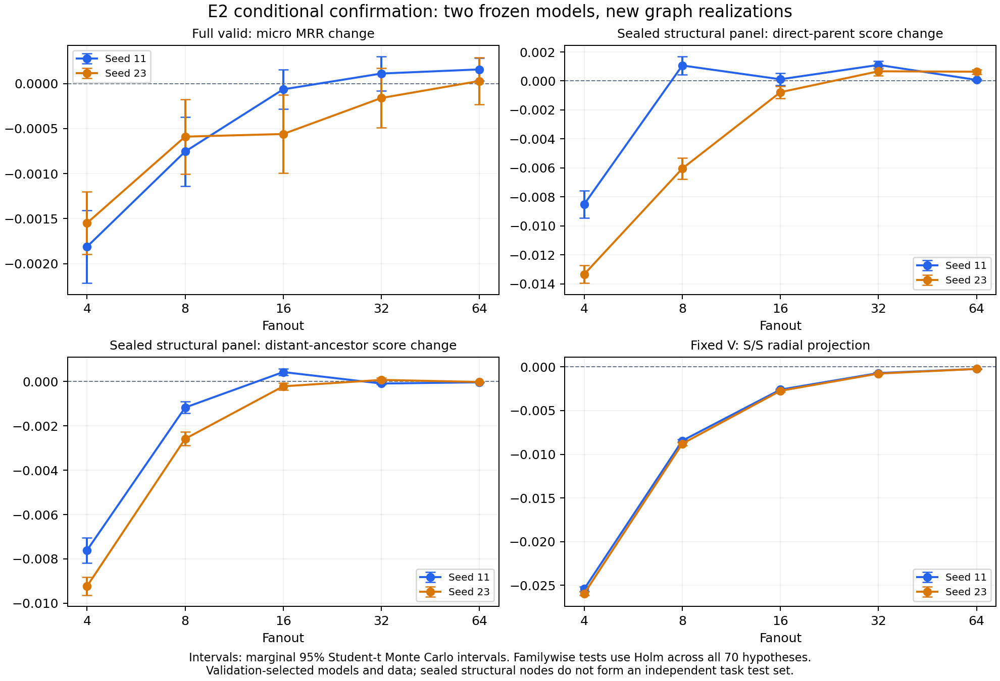

# E2 独立确认：完整十片与统一70项分析

研究问题：两个固定模型在新整图采样重复和此前未评价结构得分的确认面板上，是否再现几何偏移及结构/任务损伤？结果支持一个有边界的结论：强删减f4下，两模型的S/S直接父顺序、正远祖顺序和完整valid micro MRR均下降，统一70项Holm校正后仍非零；其他预算呈混合方向，不能概括为所有采样都会造成统一层级损伤。本批预登记条件性确认目的已达到：十片完整、所有边际半宽目标达标、独立分析及原始证据齐全。对普遍层级坍缩和机制归因的研究目的仍部分达到，后述能力参照及覆盖/选模限制必须保留。

固定源码 `49609014610fe86dbf6b19fe8a1fe94df7ecd019`，登记规范SHA256 `04f625d9bb5d61402c8f8ad1440ab4de21fad7f73ce64abb112a1138080f4d12`。原seed11/23 best768、全部fanout4/8/16/32/64；新namespace与基础seed2026091702。登记2816次配对整图重复、448次S/S完整valid，实际全部完成，没有依据结果加R、删条件、续用开发随机状态或重新选模。

## 主效应与区间

下表为S/S相对冻结full的变化。结构评价确认面板的加权covered均值；任务仍用全部valid。区间是双侧Student-t边际95% MC区间；星号表示同一70项家族的Holm校正p≤0.05，不能只凭边际区间不跨零判断家族内通过。完整原始/校正p值和按70项Bonferroni的同时区间见原分析JSON。

| seed | f | micro MRR差 [95%区间] | 直接父顺序差 [95%区间] | 正远祖顺序差 [95%区间] |
|---|---|---:|---:|---:|
| 11 | 4 | -0.0018114 [-0.0022154, -0.0014075]* | -0.0085025 [-0.0094416, -0.0075635]* | -0.0076098 [-0.0081749, -0.0070447]* |
| 11 | 8 | -0.0007552 [-0.0011381, -0.0003724]* | +0.0010673 [+0.0004453, +0.0016892]* | -0.0011751 [-0.0014359, -0.0009142]* |
| 11 | 16 | -0.0000646 [-0.0002832, +0.0001540] | +0.0001160 [-0.0003056, +0.0005376] | +0.0004257 [+0.0002696, +0.0005819]* |
| 11 | 32 | +0.0001109 [-0.0000784, +0.0003003] | +0.0011061 [+0.0008453, +0.0013669]* | -0.0000923 [-0.0001300, -0.0000546]* |
| 11 | 64 | +0.0001568 [+0.0000292, +0.0002844] | +0.0000710 [+0.0000102, +0.0001319] | -0.0000355 [-0.0000408, -0.0000303]* |
| 23 | 4 | -0.0015486 [-0.0018940, -0.0012031]* | -0.0133361 [-0.0139478, -0.0127243]* | -0.0092311 [-0.0096376, -0.0088246]* |
| 23 | 8 | -0.0005896 [-0.0010057, -0.0001735] | -0.0060415 [-0.0067677, -0.0053154]* | -0.0025863 [-0.0028932, -0.0022795]* |
| 23 | 16 | -0.0005604 [-0.0009926, -0.0001282] | -0.0007740 [-0.0011913, -0.0003567]* | -0.0002185 [-0.0003767, -0.0000604] |
| 23 | 32 | -0.0001608 [-0.0004907, +0.0001692] | +0.0006677 [+0.0003574, +0.0009780]* | +0.0000716 [-0.0000177, +0.0001608] |
| 23 | 64 | +0.0000284 [-0.0002326, +0.0002893] | +0.0006390 [+0.0004810, +0.0007970]* | -0.0000210 [-0.0000280, -0.0000139]* |

f4的micro MRR差为−0.001811/−0.001549；直接父顺序约下降0.85/1.33个百分点，正远祖约下降0.76/0.92个百分点。这确认的是两个固定模型在该预算的条件性采样损伤，不单独证明坍缩幅度标准或作用机制。任务只有seed11-f4、seed11-f8、seed23-f4三项经统一Holm通过，均为负；较大预算存在小幅正均值，但本批没有校正后支持的任务改善。

结构的20项中有11项负、5项正经Holm通过，其余4项未拒绝零。确认并未机械复现所有开发面板方向：例如seed23-f8直接父变化从开发+0.005427转为确认−0.006042；seed11-f16正远祖从开发−0.001741转为确认+0.000426。两个面板不重合且加权covered总体不同，这些差异须保留，不能混合样本或选择有利面板。

## 几何、精度与解释边界

固定V上的真实S/F、S/S径向投影在全部十个预算条件均向内并通过Holm；局部L1/F-S均值小得多，部分条件为正。因此局部方向不能替代真实两层传播方向。下表列S/S在固定V有定义方向节点上的投影：

| seed | f4 | f8 | f16 | f32 | f64 |
|---|---:|---:|---:|---:|---:|
| 11 | -0.0254063 | -0.0084456 | -0.0026013 | -0.0007065 | -0.0002353 |
| 23 | -0.0259296 | -0.0087889 | -0.0027345 | -0.0007680 | -0.0002344 |

70项均可推断且实际边际半宽达到登记目标：最大几何0.0002502（目标0.001）、结构0.0009391（目标0.001）、任务0.0004323（目标0.0005）。Bonferroni同时区间比所规划边际区间更宽；精度达标不是效应具有重要应用幅度的证明。统一Holm共拒绝47项零效应：28几何、16结构、3任务，所有原始/校正p及有符号效应完整公开。7项局部几何平均投影未高于经验数值底提示，均未通过Holm；该经验底不是严格误差界。极小p在SciPy双精度下可能下溢为0，不能解释为无限显著性；本批无零观测方差退化项。

V=82115，主几何方向有效82114、NA1；语义参考根只可达51836，unknown30279不能据物理方向当完整语义覆盖。确认面板1000child，直接父covered738、正远祖covered737，其余unknown/无covered关系保留；不将covered分母的得分称完整分支能力。A随budget从4268变1690/622/202/70，不把A的跨预算变化当固定总体。原第二层消息近边界约65.76%/64.10%，不能单凭本批识别参数化边界与曲率的因果作用。

两面板虽child不交叠，均参与原完整valid选模；任务仍是相同valid，新的是MC随机实现，不是独立任务数据或新模型/图。封存结构输出和新随机重复支持的是条件性复核，不构成泛化确认。

[可导出PDF](e2-independent-confirmation.pdf)。连接线只辅助查看固定budget，不作连续拟合；图为边际区间，家族推断以原70项Holm结果为准。

## 能力参照带来的限制

另行固定无图MLP能力对照已完成：两seed的最佳valid micro MRR为0.020537/0.019144，均高于原GNN的0.017537/0.013929；详见[E2_CAPACITY_RESULTS.md](E2_CAPACITY_RESULTS.md)。这使原GNN具有相对该有界文本参照的检索优势这一前提不成立。确认仍照原登记完整保留，不能因能力结果删除条件；但不应将弱模型上的采样损伤升级为有竞争力骨干的普遍坍缩证据。

## 质量、原始证据及成本

十片全部complete、退出0；每片原full的8456查询集合及micro/macro完全复现、检查点和权重未变。新CUDA原quality与29源码哈希匹配，各片源/批准/原数据及开发raw锚点通过。回传全部原summary、20份NPZ和20份JSON索引，共24264数组，独立核验清单、dtype、shape、内容SHA以及NPZ/索引/raw文件身份；62312命名质量记录均passed。模型无关固定分析器再次核验归档、真实双面板内容哈希/不交叠、新流及配对计划哈希、逐rep记录和全部448次完整排名，十片审计全通过，生成完整70项结果。

确认十片调度成本20693GPU秒，即5.7481GPU小时；每片L40/2CPU/16GiB，最多4卡，driver和每片实测保留，成本不作受控性能比较。进程墙钟约25分14秒至77分19秒；seed23-f4满足6600秒内/120分钟外，其余满足3300秒内/60分钟外。独立分析另用2CPU/16GiB/0GPU，调度35秒、分析进程33.56秒、最大RSS1128360KiB。所有确认GPU均已释放。

原始[独立分析JSON](e2-confirmation-independent-analysis.json) SHA256 `076efab92e89e29e6e7bd08ba18cc7e38bfbec8eb530c133df65b9eb207e45e5`；[十片结果索引](e2-confirmation-results-index.json)、[逐片核验](e2-confirmation-verification.json)、[来源和成本](e2-confirmation-metadata.json)。原NPZ、原索引、带私有artifact路径的分析输入索引及完整日志在私有证据目录留存。所有原summary/analysis按原字节复制，未改写内嵌待主管科学验收字段。

交主管独立科学验收。预定本批已结束；未增加重复、未读取test关系、未执行E3或修正干预。后续研究修订应明确能力、完整分支和噪声区分等缺口，原E1 D0亦未由本批补齐。
