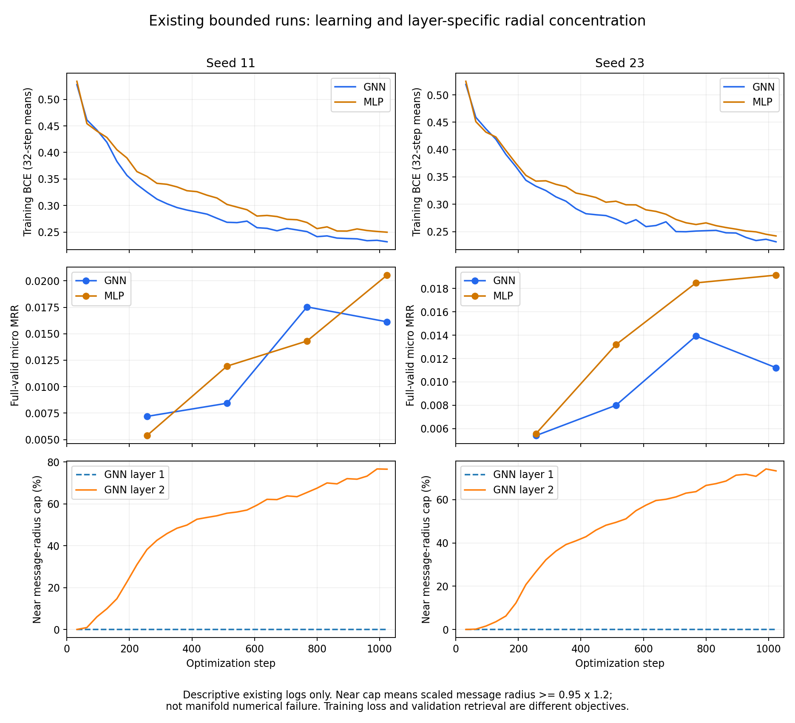

> 历史快照：以下状态、建议和授权只代表原文写作时点，不是当前执行指令。当前结论见 [报告总览](../../../README.md)。原始字节另存于归档 ZIP。

# E2骨干排查：已有学习曲线与推理预算

研究问题：当前GNN落后于有界无图MLP，是否仅因为没有学动、训练不足或验证使用完整邻域？本项只读排查达到目的：两个GNN的训练BCE持续下降，却在第768步之后验证排序回落；已有f16推理记录也未显示能弥合差距的改善。尚不能由此确定过拟合、径向压缩或图混合中的哪一项是原因。本报告不代替后续实现与数据覆盖排查。

## 训练与排序的分离

| seed | 模型 | 705–768步平均训练BCE | 961–1024步平均训练BCE | 768步valid micro | 1024步valid micro |
|---|---|---:|---:|---:|---:|
| 11 | GNN | 0.252394 | 0.233070 | 0.017537 | 0.016127 |
| 11 | MLP | 0.270589 | 0.250440 | 0.014314 | 0.020537 |
| 23 | GNN | 0.250404 | 0.233657 | 0.013929 | 0.011215 |
| 23 | MLP | 0.264558 | 0.243585 | 0.018480 | 0.019144 |

训练损失更小没有转化为更好的完整候选排序；GNN最后一次valid比各自最佳下降约8.04%/19.48%。这是已观察事实，不足以把根因指定为过拟合。只有四次valid，也不能定位真正连续最优步或证明已充分收敛。

MLP并非每个训练点都占优，例如seed11在768步仍落后GNN；最终结论采用两类模型相同四次选模机会内的各自best，不临时改成某个有利步比较。

1024步×128正例组共131072次组抽取，相当于67539组的1.9407次平均遍历。各步独立randperm取前128组，不能把1024步视为完整固定顺序的两个epoch；理论期望覆盖57857.9个组，约14.33%组未被抽到。该覆盖数是随机抽样期望，不是已核算实际唯一组数，更不是“必然只需加训”的证据。

## 第二层径向集中随训练增强

第二层near-bound比例在705–768步窗口为64.47%/63.36%，961–1024步为76.66%/73.74%；第一层在相同末段近零。这里near-bound指缩放测地半径达到固定1.2上限的95%，是模型参数化的浓集指标，不是已观察到数值出界或硬截断失败。

这些是训练前向轨迹的窗口均值，不能与冻结best完整推理的单次65.76%/64.10%混作同一统计量。浓集与验证回落同现，仍需受控比较识别其作用。

## 已有f16推理对照

冻结best上，真实两层f16采样相对完整推理的micro MRR均值变化为−0.0000646（seed11）和−0.0005604（seed23）；统一70项Holm下均未拒绝零。边际95%区间分别为[−0.0002832,+0.0001540]、[−0.0009926,−0.0001282]。不能只凭第二个边际区间宣布统一检验通过。

这没有显示把推理预算改回训练fanout即可追回MLP领先的0.003000/0.005216。该对照只改变采样，未模拟训练时随正例批次变化的边遮蔽，故不能排除全部训练/推理分布差异。

图中训练损失和径向比例按不重叠32步窗口展示，验证是原四个检查点；属于事后描述，不新增显著性检验。原四份run SHA和完整窗口数表见[e2-backbone-learning-diagnosis.json](../../../e2-backbone-learning-diagnosis.json)。只读取原train/valid记录，没有新模型前向、训练、GPU或test标签访问。
